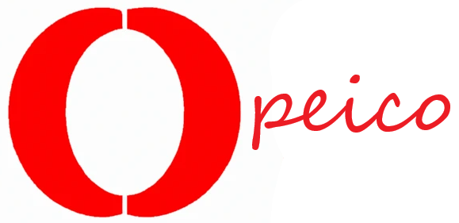

# Opeico Programming Language
Opeico: Open Programming Environment for Innovative Computing Operations
A versatile programming language merging C#, Python, and R. Clean syntax, math integration, and simple code organization make it ideal for data analysis, math computations, and general programming. Exception handling and namespace import simplify development. Join us to streamline your coding experience!

# Opeico Programming Language



Welcome to the official repository of Opeico, a versatile programming language designed to simplify coding tasks with a clean and intuitive syntax.

## Key Features

- **Clean and Readable Syntax:** Opeico's syntax is easy to understand, making it accessible for developers of all levels.

- **Math Integration:** Incorporates mathematical capabilities inspired by R and Python for data analysis and scientific computing.

- **Code Organization:** Define classes, methods, and namespaces with ease using a simplified structure.

- **Exception Handling:** Easily manage errors with built-in try-catch blocks using "$t_" and "$c_".

- **Namespace Import:** Seamlessly integrate external libraries and namespaces with "IMP: N_:".

  Similarities Between Opeico and C#

- **Syntax**: Opeico and C# share some similarities in syntax, making it easier for developers familiar with C# to transition to Opeico.

- **Object-Oriented**: Both languages are object-oriented and support classes, methods, and encapsulation.

- **Namespace Import**: They both use a similar concept for importing namespaces to access external libraries and classes.

- **Exception Handling**: Both languages support exception handling with try-catch blocks.

- **Variable Declarations**: Variable declarations in Opeico using "RUN" are conceptually similar to variable declarations in C#.

- **Method Definitions**: The structure of defining methods in both languages is similar.

- **Mathematical Operations**: Opeico's math capabilities, inspired by R and Python, share similarities with C#'s arithmetic operators.

- **String Manipulation**: Both languages support string manipulation with common operations.

- **Clean Syntax**: Both aim for clean and readable code, promoting good coding practices.

- **Main Method**: They both have a main method as an entry point to the program.

- **Community and Documentation**: Both have active communities and extensive documentation.

- **Exception Handling**: Both languages offer similar mechanisms for handling exceptions with try-catch blocks.

- **Importing Libraries**: Importing external libraries and namespaces is done using similar keywords in both languages.


## Getting Started

To start using Opeico, follow these steps:

1. Clone this repository.

2. Explore the `docs` folder for comprehensive documentation and tutorials.

3. Join our community by contributing to the development of Opeico. Check out our [Contributing Guidelines](CONTRIBUTING.md) for details.

### Import External Libraries

- **Usage**: `IMP: N_: System`, `IMP: N_: System.IO`, etc.
- **Description**: Import external namespaces and libraries into your Opeico code, extending its functionality with predefined classes and functions.

### Define Classes and Methods

- **Usage**: `DOMAIN MainClass`, `DOMAIN MyMethod()`, etc.
- **Description**: Define classes and methods as fundamental building blocks for code structure, encapsulating data and behavior.

### String Manipulation

- **Usage**: `?{"Hello, World!"}@`, `?{"Result: " + result}@".
- **Description**: Easily work with text and data by using double-quoted strings and concatenating variables and expressions.

### Exception Handling

- **Usage**: `$t_ { ... } $c_ { ... }`.
- **Description**: Implement robust error management with "Try" and "Catch" blocks, ensuring your code handles exceptions gracefully.

### Math Integration

- **Usage**: `result Kind 10 / 2`, `sum Kind a Kind b`, etc.
- **Description**: Perform mathematical operations with ease, inspired by languages like R and Python, using standard arithmetic operators.
  
### the "RUN" Keyword
- **Usage**: `RUN myVariable Kind 42`
- **Description**: In Opeico, the "RUN" keyword is used for variable declaration and assignment. You can declare and initialize variables using "RUN" followed by the variable name, "Kind," and the initial value.

### Comparison between Opeico and C#
Opeico Keywords                  |   C# Equivalents
--------------------------------|------------------------
PubC                            |   public class
PrivC                           |   private class
DOMAIN                          |   public void
DOMAIN2, DOMAIN3, ...           |   Additional methods with numbers
RUN                             |   Variable declaration and initialization
Kind                            |   Data type declaration
IMP: N_: NamespaceName          |   using NamespaceName
?{"Text"}@                      |   Console.WriteLine("Text");
$t_ { ... } $c_ { ... }  $f_ { ... }        |   try { ... } catch { ... } finally { ... }
!abs~                           |   abstract
^as                           |   as
$Base                           |   base
?bl>                            |   bool
?split                          |   break
b+                              |   byte

## Examples

```pubc

# Import necessary namespaces
IMP: N_: System
IMP: N_: System.IO
IMP: N_: System.Collections.Generic
PubC MainClass
    # Public method
    DOMAIN Main(
        ?{"Opeico Code Example"}@

        # Using Kind for equality comparison
        a Kind 10
        b Kind 20
        isEqual Kind (a Kind b)
        ?{isEqual}@
    )

